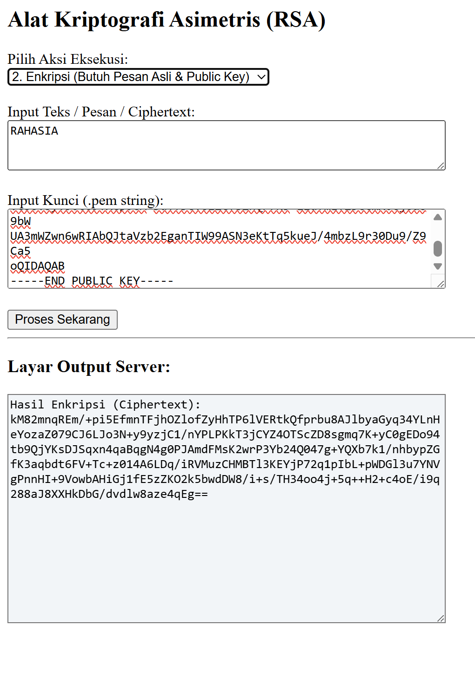
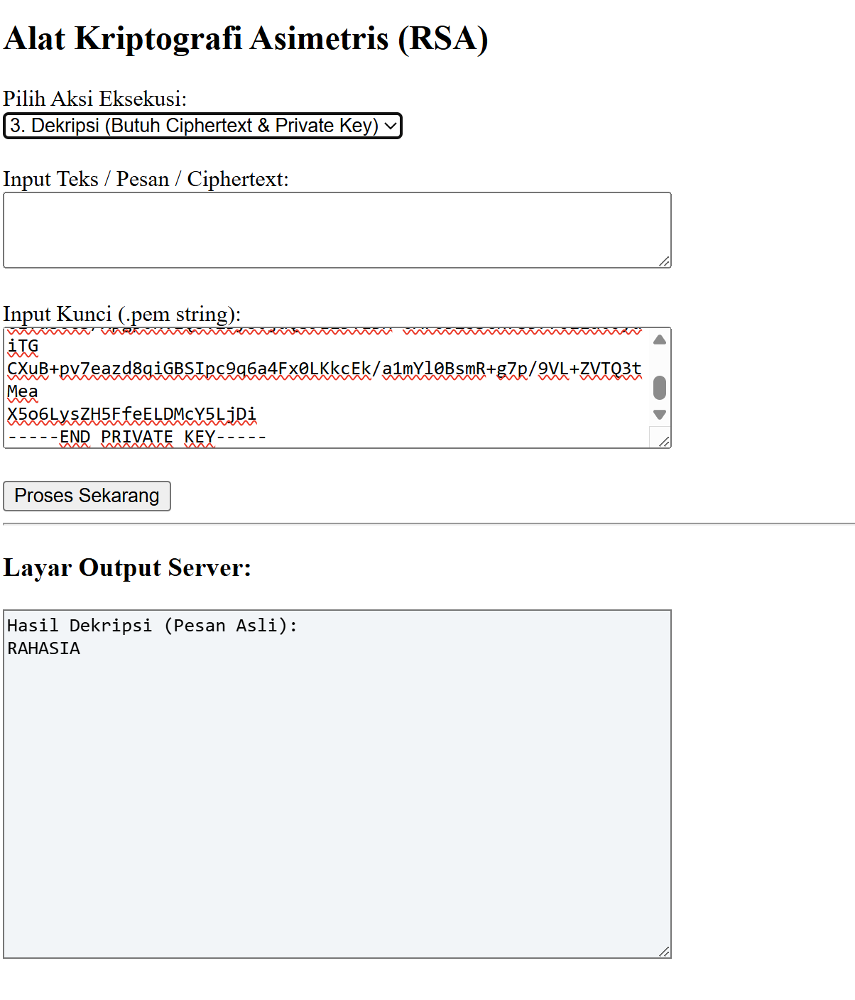

# PHP untuk melakukan proses kriptografi asimetris RSA, meliputi:

- Generate RSA Key
- Enkripsi Pesan
- Dekripsi Pesan

## Fitur

### 1. Generate RSA Key
Membuat pasangan kunci:
- Public Key
- Private Key

### 2. Enkripsi
Mengubah plaintext menjadi ciphertext menggunakan Public Key.

### 3. Dekripsi
Mengubah ciphertext kembali menjadi plaintext menggunakan Private Key.

